<a href="https://github.com/Farhan7-tech/SkyLink_P2P_Service"></a>

## About

SkyLink P2P Service is the transfer engine behind the [SkyLink File Share Application](https://github.com/Farhan7-tech/SkyLink_File_Share_Application). It has no Spring Boot and no Tomcat. It is built on the JDK's own `com.sun.net.httpserver.HttpServer` and raw `java.net` sockets, so the only thing it needs to run is Java.

Each uploaded file gets its own temporary socket server on a random port and a one-time access code. When someone downloads it with that code, the file is streamed to them and then removed from the server.

## Features

- **Share by code:** every upload returns a random 6-digit access token, and the download needs only that token.
- **One-time downloads:** after a successful download, the file, its port and its token are all cleaned up.
- **One socket server per file:** each file is served on its own port in the dynamic range (49152–65535).
- **Upload protection:**
  - 500 MB maximum file size, checked three times: the `Content-Length` header, while reading the stream, and after parsing
  - Rate limit of 10 uploads per minute per IP (`429 Too Many Requests`)
  - Allowed extensions only: `.txt .pdf .jpg .jpeg .png .gif .zip .doc .docx .csv`
  - MIME type check on the uploaded part
  - Stored under a UUID-prefixed name, so uploads can't overwrite each other
- **Hand-written multipart parser:** `multipart/form-data` is parsed at the byte level, so binary files come through intact.
- **Concurrent requests:** a fixed pool of 10 threads handles HTTP traffic.
- **CORS enabled**, so a browser frontend can call the API directly.
- **Graceful shutdown** through a JVM shutdown hook.

## How it works

```
 Uploader                    SkyLink P2P Service                    Downloader
    │                               │                                   │
    │── POST /upload (file) ───────▶│ validate → save to temp dir       │
    │                               │ pick a free port + 6-digit token  │
    │                               │ start a socket server on the port │
    │◀── { port, token } ───────────│                                   │
    │                               │                                   │
    │      shares the token ───────────────────────────────────────────▶│
    │                               │                                   │
    │                               │◀── GET /download?token=123456 ────│
    │                               │ find the port by token            │
    │                               │ connect to the file's socket,     │
    │                               │ read "Filename:" header + bytes   │
    │                               │── file (Content-Disposition) ────▶│
    │                               │ delete file, free port and token  │
```

## API

### `POST /upload`

Uploads a single file as `multipart/form-data`.

```bash
curl -F "file=@report.pdf" http://localhost:8081/upload
```

```json
{ "port": 53817, "token": "482915" }
```

| Status | Meaning |
| --- | --- |
| `200` | Uploaded. Returns the port and access token. |
| `400` | Not `multipart/form-data`, boundary missing, or body can't be parsed |
| `405` | Method other than `POST` |
| `413` | File larger than 500 MB |
| `415` | File extension or MIME type not allowed |
| `429` | More than 10 uploads in a minute from the same IP |

### `GET /download?token=<token>`

Downloads the file linked to the token. The original filename comes back in the `Content-Disposition` header.

```bash
curl -OJ "http://localhost:8081/download?token=482915"
```

| Status | Meaning |
| --- | --- |
| `200` | File stream |
| `403` | Token is invalid, missing, or already used |
| `405` | Method other than `GET` |
| `500` | Couldn't reach the file's socket server |

## Getting started

### Requirements

- Java 17+
- Maven 3.8+

### Run locally

```bash
git clone https://github.com/Farhan7-tech/SkyLink_P2P_Service.git
cd SkyLink_P2P_Service
mvn compile
java -cp target/classes P2P.App
```

The server starts on port **8081**. To use a different port, set the `PORT` environment variable, as hosts like Render do:

```bash
PORT=9000 java -cp target/classes P2P.App
```

Uploaded files are stored temporarily in `<system temp dir>/SkyLink-uploads`.

## Project structure

```
src/main/java/P2P/
├── App.java                    # Entry point: reads PORT, starts the server, registers the shutdown hook
├── Controller/
│   └── FileController.java     # Creates the HttpServer, registers routes, owns the thread pool
├── Service/
│   └── FileSharer.java         # Port/token registry, per-file socket server, cleanup
├── handler/
│   ├── UploadHandler.java      # POST /upload: validation, rate limiting, storage
│   ├── DownloadHandler.java    # GET /download: token lookup, stream from socket to client
│   └── CORSHandler.java        # CORS preflight + 404 fallback
└── Utils/
    ├── MultiParser.java        # Byte-level multipart/form-data parser
    └── UploadUtils.java        # Random port in the dynamic range
```

## Things to know

- A file's socket server waits **50 seconds** for a connection. If nobody downloads in that window, the file can no longer be downloaded.
- Tokens and file info are kept in memory, so restarting the server clears every pending share.
- Uploads are buffered in memory before they're written to disk, so plan server memory around the 500 MB limit.

## Related

- **[SkyLink File Share Application](https://github.com/Farhan7-tech/SkyLink_File_Share_Application):** the main app (Spring Boot + React) that this service powers.

<br>

<a href="https://github.com/Farhan7-tech"></a>
